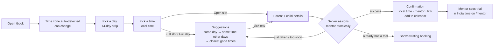

# PRD: Trial-Class Booking

| | |
|---|---|
| Status | Ready for implementation |
| Owner | Amit Pile |
| Last updated | 2026-10-08 |
| Related | [Technical Design](./TECHNICAL_DESIGN.md) |

**Contents:** 1 Problem · 2 Goals · 3 Personas · 4 Research summary · 5 User journey · 6 Functional requirements · 7 Scheduling rules · 8 Suggestions · 9 Time display rules · 10 Screens & copy · 11 Edge cases · 12 Non-functional · 13 Out of scope · 14 Assumptions · 15 Glossary

---

## 1. Problem

Codeyoung parents (mostly US and UK) book a free trial class before signing up. Mentors are in India. The booking experience has to:

- show times the parent can trust **in their own time zone**, including across Daylight Saving Time (DST) changes;
- only offer times that are **sensible for the child** and **inside the mentor's working shift**;
- assign a mentor who is actually free, with **at most 2 trials per mentor per day**;
- never double-book, even when two parents click at the same moment;
- when a time is unavailable, **steer the parent to the next best time** instead of a dead end.

Scale: **10 mentors**, **~20 parents/day**. Capacity is 10 × 2 = **20 trials/day**, so demand roughly equals supply and "no availability" is a *normal* state, not an edge case.

## 2. Goals and success metrics

| Goal | Metric |
|---|---|
| Fast, confident booking | Booking completed in < 60 s; every displayed time shows weekday, date, time and zone |
| Correctness | 0 double bookings; 0 mentors with > 2 trials on one IST date; proven by concurrency tests on real Postgres |
| Sensible hours | 0 slots offered outside 08:00–21:00 parent-local or outside the assigned mentor's shift |
| Never a dead end | Every "unavailable" outcome shows ≥ 1 suggestion, or an explicit "fully booked for 14 days" state |
| Mentor clarity | Mentors see each trial in India time, with daily load (`n / 2`) and the parent's local time |

## 3. Personas

| Persona | Time zone | Needs |
|---|---|---|
| **Parent** | US (Eastern, Central, Mountain, Arizona, Pacific, Alaska, Hawaii) or UK / Ireland | Pick a convenient local time, get confirmation + class link, add to calendar, cancel |
| **Mentor** | India (`Asia/Kolkata`, no DST), working a region-aligned shift | See assigned trials in India time with child/parent details, the link and their daily load |
| **Reviewer / Ops** | — | Run locally in minutes; see every edge state in seed data |

## 4. Research summary

| Source | What it does | What we take |
|---|---|---|
| Codeyoung "Book a Free Trial" | Subject, child's grade, parent contact → slot picker in local time → confirmation with class link | Same data captured; we ask for the **time first** (higher-intent step), then details |
| Codeyoung mentor hiring | US-shift mentors work **2:30–7:30 AM IST** | Mentors work **region-aligned shifts**, including night shifts for US families |
| Cuemath tutor hiring | US shift **12:00–7:00 AM IST**, ≥ 4 h/day | Same pattern |
| PlanetSpark, BrightChamps | "Night shift / US students", "US East Coast timings" roles | Same pattern |
| Calendly, Cal.com | Host sets working hours in *their* zone; invitee sees them converted; optional per-day booking limit | Availability = mentor's own shift; parent sees it converted; 2/day cap on top |

**Conclusion:** "reasonable hours" is enforced *per side*. The family gets child-friendly local hours. The mentor gets only the shift they signed up for. A single global IST window (e.g. 08:00–22:00 IST) is **wrong**: it leaves US East/Central families with mornings only (school time on weekdays).

## 5. User journey

## 6. Functional requirements

Each requirement has acceptance criteria (AC) used for tests.

| ID | Requirement | Acceptance criteria |
|---|---|---|
| **FR-1** Time zone | Detect the parent's IANA zone from the browser; allow changing it via a searchable picker (US, UK, Ireland, India pinned on top); remember the choice in the browser. | AC1 New York browser → "Eastern Time (UTC−04:00)" shown. AC2 Change to London → all slots re-render in UK time. AC3 Legacy name `Asia/Calcutta` is accepted. AC4 Detection fails → picker opens, no default. |
| **FR-2** Slot calendar | Show the next **14 days** as a day strip; for the selected day show slots grouped **Morning (8–12) / Afternoon (12–5) / Evening (5–9)** by local start time. Slots with no free mentor show as **Full** (greyed, clickable for suggestions). Times when no mentor works aren't shown. | AC1 Each slot shows local time + zone abbreviation. AC2 Full slots are visibly different and announce "Full" to screen readers. AC3 Day strip marks each day Open / Few left / Full / No classes. |
| **FR-3** Slot rules | Trial = **60 min**, starts on a **30-min grid**, needs ≥ **2 h** notice, ≤ **14 days** ahead. All configurable. | AC1 No slot starts < 2 h from server "now". AC2 No slot beyond 14 days. |
| **FR-4** Reasonable hours | A slot is offered only if the whole class is inside **08:00–21:00 parent-local** *and* inside **at least one mentor's shift** (see §7). | AC1 No slot outside either window across a DST change. AC2 A crafted API request for 3 AM local is rejected (`OUTSIDE_HOURS`). |
| **FR-5** Availability | A slot is **Open** if ≥ 1 mentor (a) has a shift covering the whole class, (b) has no overlapping confirmed class, (c) has < 2 confirmed trials on that **IST date**. | AC1 A mentor at 2/2 disappears from all other slots that IST date. AC2 Cancelling restores availability immediately. |
| **FR-6** Booking form | Parent name, email, phone (optional), child name, grade (1–12), subject (Coding / Math). Subject is shown to the mentor, not used for matching. Same validation on client and server. | AC1 Field errors appear inline (see Technical Design §9.3 for exact rules). |
| **FR-7** Mentor assignment | On submit the server picks an eligible mentor **atomically**, preferring the least-loaded mentor that day. Generates a booking reference (`CY-7K3P9Q`) and a dummy class link. | AC1 Never two confirmed classes overlapping for one mentor. AC2 Never > 2 per mentor per IST date. AC3 Double-submit creates one booking. |
| **FR-8** Confirmation | Shows parent-local date/time + zone, the same time in India time, mentor card (name, short bio, shift), class link with copy button, Add to Calendar (.ics + Google), reference, Cancel. | AC1 If the browser's current zone ≠ booked zone, also show the time in the current zone. |
| **FR-9** Mentor notification | The mentor receives the same booking **rendered in India time** (stored notification shown in the mentor view; stand-in for email). The parent's notification is rendered in the parent's zone. | AC1 Mentor text shows IST date/time + parent's local time. |
| **FR-10** Mentor view | `/mentor`: choose a mentor; see their shift, and upcoming trials grouped by IST date with a capacity meter (`1 / 2`), child, subject, parent's local time, link. | AC1 Dates/times in India time, labelled "India Standard Time (UTC+05:30)". |
| **FR-11** Suggestions | Whenever the chosen time can't be booked (Full slot clicked, Full day selected, booking lost a race, slot became too soon) show suggestions using the cascade in §8. One click books the suggestion with the form data kept. | AC1 Each cascade step returns the documented results (§8). AC2 Suggestions never violate FR-3/FR-4/FR-5. |
| **FR-12** Manage booking | `/manage`: look up by reference + email; view; cancel (until class start). | AC1 Wrong email → "not found" (no information leak). AC2 Cancel twice → same result, no error. |
| **FR-13** One active trial | One parent email may hold only **one upcoming confirmed trial**. | AC1 Second attempt shows the existing booking with a link to manage it. |
| **FR-14** DST notice | If a clock change happens in the parent's zone within the 14 days, show a banner on the calendar. | AC1 With "now" = 20 Oct 2026, New York shows "Clocks go back on Sun 1 Nov. Times from then are in EST." AC2 With "now" = 8 Oct 2026 (horizon ends 22 Oct) no banner shows. Reviewers can see it live by setting `BOOKING_HORIZON_DAYS=30`. |

## 7. Scheduling rules: reasonable hours on both sides

### 7.1 The two rules

| Side | "Reasonable" means | Rule |
|---|---|---|
| **Parent / child** | Not before 8 AM or after 9 PM where the child lives | Whole class inside **08:00–21:00 parent-local**, worked out **for each local date** (so DST is automatic) |
| **Mentor** | Only hours they agreed to work, which may be an IST night shift | Whole class inside **one of the mentor's shift rules** (weekly hours in the mentor's own zone). No global IST cap. Wellbeing is protected by opt-in shifts + 2 trials/day cap |

### 7.2 Shifts (seed data, IST)

| Shift | IST hours | Serves |
|---|---|---|
| UK shift | 13:00–23:30 | UK/Ireland daytime and after-school; US mornings |
| US-East shift | 00:30–07:30 | US East/Central after-school evenings (Codeyoung's real US shift is 2:30–7:30 AM IST) |
| US-West shift | 03:30–09:30 | US Pacific/Mountain/Alaska/Hawaii afternoons and evenings |

No shift crosses IST midnight, so the 2-trials-per-day cap maps cleanly onto one IST calendar date (that's why the US-East shift starts at 00:30). Each mentor takes one day off per week (staggered), defined per weekday in **IST**.

### 7.3 What each parent zone gets

Class start times, computed with real zone rules, combining all shifts and the 08:00–21:00 parent window (weekday with all mentors working):

| Parent zone | 20 Oct 2026 (before clocks change) | 10 Nov 2026 (after) |
|---|---|---|
| UK / Ireland | 8:30 AM–6:00 PM, plus 8:00 PM (BST) | 8:00 AM–5:00 PM, plus 7:00–8:00 PM (GMT) |
| US Eastern | 8:00 AM–1:00 PM and **3:00–8:00 PM EDT** | 8:00 AM–12:00 PM and **2:00–8:00 PM EST** |
| US Central | 8:00 AM–12:00 PM and **2:00–8:00 PM CDT** | 8:00–11:00 AM and **1:00–8:00 PM CST** |
| US Mountain (Denver) | 8:00–11:00 AM and **1:00–8:00 PM MDT** | 8:00–10:00 AM and **12:00–8:00 PM MST** |
| Arizona (no DST) | 8:00–10:00 AM and **12:00–8:00 PM MST** | same |
| US Pacific | 8:00–10:00 AM and **12:00–8:00 PM PDT** | 8:00–9:00 AM and **11:00 AM–7:00 PM PST** |
| Alaska | 8:00–9:00 AM and 11:00 AM–7:00 PM AKDT | 8:00 AM and 10:00 AM–6:00 PM AKST |
| Hawaii | 9:00 AM–5:00 PM HST | 9:00 AM–5:00 PM HST |

Every region gets **after-school evening** slots. Clock changes move the edges: London's last afternoon start moves from 6:00 PM to 5:00 PM after 25 Oct; US Pacific's last evening start moves from 8:00 PM to 7:00 PM after 1 Nov. These come out of the per-day calculation and are never hard-coded. This table is also a test fixture (Technical Design §14).

## 8. Suggestions when the chosen time isn't available

Input: the parent wanted **date D at local time T** (e.g. Sat 31 Oct, 9:00 AM). Try each step in order and **stop at the first step that finds something**.

| Step | Applies when | Returns | Headline shown |
|---|---|---|---|
| **1 · Same day** | D has ≥ 1 Open slot | Up to **4** Open slots on D, closest to T first (ties: earlier first) | "No mentor is free at 9:00 AM on Sat 31 Oct. These times that day are open:" |
| **2 · Same time, other days** | D has no Open slot (every mentor busy or at 2/2) | Up to **3** other days (today onwards, within 14 days) where **T itself** is Open, nearest to D first (ties: later day first) | "Sat 31 Oct is fully booked. 9:00 AM is open on these days:" |
| **3 · Closest good times** | T isn't Open on any day | Up to **4** Open slots from the earliest days with openings, **max 2 per day**, each the closest to T on its day | "We couldn't find 9:00 AM on nearby days. Here are the closest good times:" |
| **4 · Nothing open** | No Open slot in 14 days | Empty state | "We're fully booked for the next two weeks. Leave your email and we'll reach out when a slot opens." (email capture is shown as a contact link only; no waitlist logic) |

Rules for every step:

- Suggestions come from **the same slot list as the calendar**, so they always respect notice, horizon, both reasonable-hours rules and capacity.
- "Same time" means the **same local clock time for the parent**. Across a DST change that is a different UTC/IST moment, which is intended.
- If T is inside mentor hours before a clock change but not after (or the reverse), step 2 adds a note, e.g. "From Mon 2 Nov, 8:00 PM PT is outside our mentors' hours."
- Each suggestion shows weekday, date, local time and zone, and books with one click.

## 9. Time display rules

1. Always show **weekday, date, time and zone**: `Sat 31 Oct · 8:30 AM EDT`.
2. Headers show full zone name + UTC offset: `Eastern Time (UTC−04:00)`.
3. **Never a bare "IST".** It means *India Standard Time* and also Irish summer time. India is shown as `IST (India)` short / `India Standard Time (UTC+05:30)` long; Dublin as `GMT` / `GMT+1` short / `Irish time (UTC+01:00)` long.
4. London shows `BST` / `GMT` (browsers in US-English print "GMT+1", so we use our own label map).
5. DST banner per FR-14.
6. If the booked zone ≠ current browser zone, also show the current-zone time.
7. Times use tabular numerals; 12-hour clock for US/UK parents, 24-hour optional for mentors (12-hour by default for consistency).

## 10. Screens and key copy

| Screen | Content | States & copy |
|---|---|---|
| `/book` step 1 "Pick a time" | Time-zone bar, DST banner, 14-day strip, slot groups | Loading: skeleton. Day `FULL`: "This day is fully booked" + suggestions. Day `CLOSED`: "No classes on this day." Horizon empty: step 4 copy. Network error: toast "Couldn't load times. Retry". |
| `/book` step 2 "About your child" | Selected slot pinned on top ("Change"), form | Submitting: button "Booking…" (disabled). 409 / 422 slot errors: suggestions panel in place, form kept. `ACTIVE_TRIAL_EXISTS`: "You already have a trial on Tue 3 Nov · 4:00 PM EST." + "View booking". |
| `/booking/:ref` Confirmation | Big local time, India time, mentor card, link + copy, add to calendar, reference, cancel | Copy link → toast "Link copied". Cancelled booking: "This booking was cancelled" + "Book another time". |
| `/manage` | Reference + email form → booking details → cancel (confirm dialog) | Not found: "We couldn't find a booking with those details." Already started: "This class has already started and can't be cancelled." |
| `/mentor` | Mentor picker, shift label, agenda by IST date, capacity meter, notifications | No trials: "No trials booked in the next 14 days." |

## 11. Edge cases

Each row has a test (Technical Design §14).

### 11.1 Time zones and DST

| # | Scenario | Expected behaviour |
|---|---|---|
| T1 | UK leaves BST on **25 Oct 2026**, US leaves EDT on **1 Nov 2026**; for a week the UK–US gap is 4 h, not 5 h | The 18:00 IST class shows as 1:30 PM BST (before 25 Oct) / 12:30 PM GMT (after), and 8:30 AM EDT (31 Oct) / 7:30 AM EST (2 Nov). Never fixed offsets. |
| T2 | A DST day is 23 or 25 hours long in the parent zone | Days grouped by the real local day; nothing lost or duplicated. |
| T3 | Repeated hour on fall-back night (1:00–2:00 AM twice) | Never offered (parent window starts 08:00). The formatter still labels both correctly (`1:30 AM EDT` vs `1:30 AM EST`). Unit-tested. |
| T4 | Skipped hour on spring-forward night (2:00–3:00 AM) | Never offered to parents. Mentor rules in a DST zone shift forward predictably (unit-tested with a non-India zone). |
| T5 | Parent's day and mentor's day differ (Tue 7:30 PM PT = Wed 8:00 AM IST) | Each side sees its own weekday/date; capacity counts on the IST date. |
| T6 | Zones with/without DST: all US zones, Arizona, Hawaii, Alaska, UK, Ireland | Correct conversions both sides of each transition. |
| T7 | "IST" ambiguity | Display rule 3. |
| T8 | Browser reports `Asia/Calcutta` / `US/Eastern`, or nothing | Accepted and normalised; nothing → manual picker. |
| T9 | Parent travelling (current zone ≠ booked zone) | Both times shown on confirmation. |
| T10 | Parent's device clock is wrong | Server decides "now"; past/too-soon filtering is server-side. |
| T11 | Clock change moves slots at the edges of the windows | Per-day calculation; matches §7.3 table (London 6 PM → 5 PM last start; Pacific 8 PM → 7 PM). |
| T12 | "Same time, other days" across a DST change | Matches the parent's local clock time; the IST time differs, intentionally. |
| T13 | Absurd family hours (e.g. 3 AM US) requested via the API | Rejected `OUTSIDE_HOURS`. |
| T14 | Time outside every mentor's shift | Not offered; API rejects `OUTSIDE_HOURS`; mentors never assigned outside their own shift. |

### 11.2 Capacity, availability, concurrency

| # | Scenario | Expected behaviour |
|---|---|---|
| C1 | Two parents grab the last free mentor at the same moment | Exactly one succeeds; the other sees suggestions with "That time was just booked." |
| C2 | Same slot, several mentors free | Both succeed with different mentors. |
| C3 | Mentor reaches 2 trials on an IST date | Disappears from every other slot on that IST date. |
| C4 | All staffed mentors busy at a time | Slot shows Full; clicking it shows suggestions. |
| C5 | All mentors at 2/2 for the day | Day shows Full; suggestions start at step 2. |
| C6 | Parent's local day spans two IST dates | Availability shown slot by slot; never assume one local day = one IST date. |
| C7 | Double-click / network retry | One booking; same confirmation returned. |
| C8 | Same parent books from two tabs | Second attempt → existing booking shown. |
| C9 | Slot becomes < 2 h away while the form is open | "This time is now too soon to book" + suggestions. |
| C10 | Booking cancelled | Slot and capacity freed immediately. |
| C11 | Whole 14 days full | Step 4 empty state. |
| C12 | Invalid input (bad email, grade 0, unknown zone, off-grid time) | Inline field errors; server returns the same messages. |

## 12. Non-functional requirements

- **Correctness enforced by the database**, not only by application code.
- **Accessibility:** keyboard-navigable slot grid; slot buttons labelled with full date/time/zone and status; visible focus; WCAG AA contrast.
- **Responsive** down to 360 px.
- **Performance:** slot listing < 200 ms on seed data.
- **Security hygiene:** validation on every input; rate limit on booking; lookup needs reference **and** email; no stack traces in responses.

## 13. Out of scope (with reasons)

| Item | Why not now |
|---|---|
| Accounts / auth | Not graded; reference + email covers self-service |
| Real email / WhatsApp | Stored per-zone notifications stand in; a provider can be plugged in later |
| Rescheduling | Cancel + rebook covers it |
| Mentor holidays / time-off | Rule model extends with an `exceptions` table |
| Admin UI for shifts | Shifts come from seed data; changing them is a data change |
| Subject / language matching | Spec says "any available mentor"; would shrink tight capacity further |
| Soft holds during checkout | Needs expiry jobs; atomic final check + suggestions handles the race at this scale |
| Waitlist | Step 4 shows a contact link only |

## 14. Assumptions

- "Per day" for the 2-trial cap = the mentor's **IST calendar date**; shifts don't cross IST midnight.
- Trial length 60 min; no buffer between classes.
- All mentors are in India, but the code treats each mentor's zone generically.
- Parent-friendly hours 08:00–21:00 local, every day of the week.
- Shift weekdays are defined in the mentor's zone (IST).

## 15. Glossary

| Term | Meaning |
|---|---|
| Slot | A 60-min class start on the 30-min UTC grid |
| Open / Full | Open: ≥ 1 mentor can take it. Full: some mentor works then, but none is free |
| Closed day | No mentor works at any reasonable time that day |
| Shift | A mentor's weekly working hours (availability rule) in their own zone |
| IST date | Calendar date in `Asia/Kolkata`; the key for the 2/day cap |
| Parent window | 08:00–21:00 in the parent's zone |
