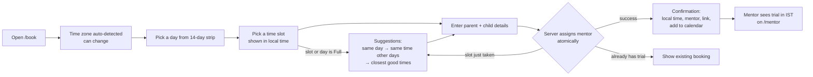

# PRD: Trial-Class Booking

| | |
|---|---|
| Status | Draft for review |
| Owner | Amit Pile |
| Last updated | 2026-10-07 |
| Related | [Technical Design](./TECHNICAL_DESIGN.md) |

## 1. Problem

Codeyoung parents (mostly US and UK) book a free trial class before signing up. Mentors are in India. The booking experience has to:

- show times the parent can trust in their own time zone, including across Daylight Saving Time changes;
- assign a mentor who is actually free, never more than **2 trials per mentor per day**;
- never double-book, even when two parents click at the same moment;
- when a time is gone, steer the parent to the next best time instead of a dead end.

Scale for this exercise: **10 mentors**, **~20 parents/day**. Capacity is 10 × 2 = **20 trials/day**, so demand is roughly equal to supply and "no availability" is a *normal* state.

## 2. Goals and success metrics

| Goal | Metric |
|---|---|
| Fast, confident booking | A parent completes a booking in < 60 s; every displayed time carries date, weekday and zone |
| Correctness | 0 double bookings; 0 mentors with > 2 trials on an IST day; verified by concurrency tests against Postgres |
| Never a dead end | 100% of "unavailable" outcomes show at least one alternative (or an explicit "fully booked for 14 days" state) |
| Mentor clarity | Mentors see every trial in India Standard Time with their daily load |

## 3. Personas

| Persona | Time zone | Needs |
|---|---|---|
| **Parent** | US (Eastern, Central, Mountain, Arizona, Pacific, Alaska, Hawaii) or UK / Ireland | Choose a convenient local time, get confirmation + class link, add to calendar, cancel |
| **Mentor** | India (`Asia/Kolkata`, no DST) | See assigned trials in IST, with child/parent details and link |
| **Reviewer / Ops** | — | Run locally in minutes, see edge states in seed data |

## 4. User journey

This follows Codeyoung's real flow (subject, grade, parent contact, slot picker, confirmation with link), except we put the **time choice first**. Parents commit to a time before typing details, which is the higher-intent step.

## 5. Functional requirements

| ID | Requirement |
|---|---|
| FR-1 | Detect the parent's IANA time zone from the browser. Allow changing it through a searchable picker (US, UK/Ireland, India pinned at top). Remember the choice locally. |
| FR-2 | Show slots for the next **14 days**, grouped by the parent's local date, then by Morning / Afternoon / Evening. Every slot shows its local time and zone abbreviation. Slots with no free mentor are still shown as **"Full"** (greyed, but clickable to get suggestions), so parents understand why a time they expected isn't bookable. |
| FR-3 | Trial classes are **60 minutes**, start on a **30-minute grid**, need at least **2 hours'** notice, and can be booked at most **14 days** ahead. All configurable. |
| FR-13 | **Reasonable hours on both sides** (see §6.1). A slot is only ever offered or suggested if the whole class falls inside **mentor operating hours (08:00–22:00 in the mentor's zone, i.e. IST)** *and* **parent-friendly hours (08:00–21:00 in the parent's zone)**. Both windows are evaluated per calendar day using real zone rules, so DST shifts are handled automatically. Mentor availability rules outside operating hours are rejected. |
| FR-4 | A slot is available only if at least one mentor: (a) is working for the whole class according to their availability hours, (b) has no overlapping confirmed class, (c) has fewer than 2 confirmed trials on that **IST calendar date**. |
| FR-5 | Booking form: parent name, email, phone (optional), child name, grade (1–12), subject (Coding / Math). Subject is recorded for the mentor but not used for matching. |
| FR-6 | On submit, the system assigns an eligible mentor atomically and generates a dummy class link and a booking reference like `CY-7K3P9Q`. |
| FR-7 | Confirmation shows: parent-local date/time with zone, the same time in the mentor's zone, mentor card, class link with copy button, Add to Calendar (.ics and Google Calendar), reference, cancel option. |
| FR-8 | The mentor receives the booking in **their** local time. A notification record is rendered in IST and shown in the mentor view (stand-in for email). |
| FR-9 | Mentor view (`/mentor`): choose a mentor and see upcoming trials grouped by IST date, a daily capacity meter (e.g. `1 / 2`), parent's local time, and the class link. |
| FR-10 | No availability: whenever the parent's chosen time can't be booked (they click a "Full" slot, a fully booked day, or their booking loses a race at submit), show **smart suggestions** using the cascade in §6.2: same day → same time on nearby days → best upcoming times. Suggestions are one-click; the form data is kept. If nothing is open in the 14-day window, show an empty state with a contact message. |
| FR-11 | Manage booking (`/manage`): look up by reference + email, view, and cancel. Cancelling frees the slot and the mentor's daily capacity immediately. |
| FR-12 | One parent email may hold only **one upcoming confirmed trial**. A second attempt shows the existing booking rather than an error. |

## 6. Display rules for time

1. Always show **weekday, date, time and zone**, e.g. `Sat 31 Oct · 8:30 AM EDT`.
2. Headers show the full zone name plus UTC offset, e.g. `Eastern Time (UTC−04:00)`.
3. Never show a bare **"IST"**. It means *India Standard Time* and also *Irish Standard Time* (Dublin in summer). Mentors see `India Standard Time (UTC+05:30)`; Dublin parents see `Irish time (UTC+01:00)`.
4. When the parent's booking window crosses a clock change, show a banner: "Clocks change on Sun 1 Nov — times after this are in EST."
5. If the parent's current browser zone differs from the booked zone, also show the time in the current zone.
6. Zone abbreviations come from our own label helper, not straight from the browser. For example, US-English browsers print London summer time as "GMT+1"; we show "BST".

### 6.1 Reasonable hours (no absurd times for anyone)

Two windows must **both** contain the whole 60-minute class:

| Side | Window (configurable) | Evaluated in |
|---|---|---|
| Mentor operating hours | 08:00–22:00 | Mentor's zone (IST) |
| Parent-friendly hours | 08:00–21:00 | Parent's zone, recomputed per day (DST-aware) |

What this gives each parent region. Computed from real zone rules; class starts, 30-min steps:

| Parent zone | Before clock change (e.g. 20 Oct 2026) | After clock change (e.g. 10 Nov 2026) |
|---|---|---|
| UK / Ireland | 08:00–16:30 BST / IST-Irish (= 12:30–21:00 India) | 08:00–15:30 GMT (= 13:30–21:00 India) |
| US Eastern | 08:00–11:30 AM EDT | 08:00–10:30 AM EST |
| US Central | 08:00–10:30 AM CDT | 08:00–09:30 AM CST |
| US Mountain (Denver) | 08:00–09:30 AM MDT | 08:00–08:30 AM and 7:30–8:00 PM MST |
| Arizona (no DST) | 08:00–08:30 AM and 7:30–8:00 PM MST | same (Arizona doesn't change; India doesn't change) |
| US Pacific | 08:00–08:30 AM and 7:30–8:00 PM PDT | 6:30–8:00 PM PST |
| Alaska | 6:30–8:00 PM AKDT | 5:30–8:00 PM AKST |
| Hawaii | 4:30–8:00 PM HST | 4:30–8:00 PM HST |

**Product finding to flag:** with mentors limited to 08:00–22:00 IST, US East/Central parents only get **morning** slots. On weekdays that clashes with school, so US demand will lean heavily on **weekends**. If US conversion matters, the business can extend mentor operating hours (a config change). The suggestion engine and windows don't need code changes.

### 6.2 Suggestions when the chosen time isn't available

The parent picked **date D at local time T**. We try, in order, and stop at the first step that finds something:

| Step | When it applies | What we show | Example message |
|---|---|---|---|
| 1. Same day, other times | D still has open slots | Up to 4 open slots on D, **closest to T first** | "No mentor is free at 9:00 AM on Sat 31 Oct. These times that day are open:" |
| 2. Same time, other days | D is fully booked (every mentor is busy or already has 2 trials that IST day), or has nothing open | Up to 3 nearest upcoming days where **the same local time T** is open (closest to D first, never in the past) | "Sat 31 Oct is fully booked. 9:00 AM EST is open on:" |
| 3. Best upcoming times | T isn't open on any day in the window | Up to 4 slots over the next days that have openings, **at most 2 per day**, each the closest to T on its day | "We couldn't find 9:00 AM on nearby days. Here are the closest good times:" |
| 4. Nothing open | 14-day window is fully booked | Empty state + contact message | "We're fully booked for the next two weeks…" |

Rules that apply to every step:
- Suggestions come from the same slot list as the calendar, so they are **always inside both reasonable-hours windows** (§6.1) and respect the 2-hour notice and 14-day horizon.
- "Same time" means the **same local clock time for the parent**. Across a DST change that is a different moment in UTC and in IST, and that's intended (the parent wants 9 AM *their* time).
- If T falls outside the reasonable window on later days because of a clock change (e.g. 8:00 AM Pacific stops being offered after 1 Nov), step 2 skips those days. The message says so: "From 2 Nov, 8:00 AM PT is outside our mentors' hours."
- Each suggestion shows weekday, date, local time and zone, and books in one click.

## 7. Edge cases

### 7.1 Time zones and DST

| # | Scenario | Expected behaviour |
|---|---|---|
| T1 | UK leaves BST on **25 Oct 2026**, US leaves EDT on **1 Nov 2026**. For one week the UK–US gap is 4 h, not 5 h. | The same 18:00 IST class shows as 8:30 AM EDT on 31 Oct and 7:30 AM EST on 2 Nov; for London 1:30 PM BST before 25 Oct and 12:30 PM GMT after. Never computed from fixed offsets. |
| T2 | A DST day is 23 or 25 hours long in the parent zone | Days are grouped by the real local day; no slot is lost or duplicated. |
| T3 | 1:30 AM happens twice on fall-back night | Two different slots, labelled `1:30 AM EDT` and `1:30 AM EST`. |
| T4 | A local time that doesn't exist (spring-forward gap) | Parents never pick a non-existent time (slots are absolute instants). Mentor availability in a DST zone is shifted forward predictably. |
| T5 | Parent's evening is the mentor's next day (Tue 11:30 PM PT = Wed 12:00 PM IST) | Both sides see their own weekday/date. Mentor capacity counts on the IST date. |
| T6 | US zones with and without DST (Arizona, Hawaii), Alaska, UK, Ireland | All convert correctly on both sides of each transition. |
| T7 | "IST" ambiguity | See display rule 3. |
| T8 | Browser reports a legacy zone name (`Asia/Calcutta`, `US/Eastern`) or none | Accepted and normalised; if none, parent picks a zone manually. |
| T9 | Parent is travelling | Confirmation shows booked zone *and* current zone. |
| T10 | Parent's device clock is wrong | The server decides "now"; the past and too-soon slots are filtered server-side. |
| T11 | A clock change moves slots in or out of the reasonable window (LA loses 8 AM slots after 1 Nov; London loses 4 PM after 25 Oct) | Windows recomputed per day; the DST banner explains the shift. |
| T12 | "Same time on other days" across a DST change | Matches the parent's local clock time; the IST time shown to the mentor changes accordingly. |
| T13 | Absurd hours (3 AM for a US parent, 1 AM for a mentor) | Never offered or suggested; booking API rejects them with `OUTSIDE_HOURS`. |

### 7.2 Capacity, availability and concurrency

| # | Scenario | Expected behaviour |
|---|---|---|
| C1 | Two parents grab the last free mentor for a slot at the same moment | Exactly one succeeds; the other sees "That time was just booked" with suggestions (§6.2). |
| C2 | Two parents pick the same slot and several mentors are free | Both succeed with different mentors. |
| C3 | A mentor reaches 2 trials on an IST day | They disappear from every other slot that day. |
| C4 | Every mentor is busy for a slot | Slot shows as "Full"; clicking it (or picking it from a stale screen) shows suggestions. |
| C4a | Every mentor already has 2 trials on that IST day | The whole day shows "Fully booked"; suggestions skip to step 2 (same time on nearby days). |
| C4b | Parent's local day spans two IST days | Some of that local day may be full (IST day 1 at capacity) while the rest is open (IST day 2). Shown slot by slot, never by assuming one local day = one IST day. |
| C5 | Parent double-clicks "Book" or the network retries | Only one booking is created; the same confirmation is returned. |
| C6 | Same parent books from two tabs | Second attempt shows the existing booking. |
| C7 | Slot drops inside the 2-hour notice window while the form is open | "This time is now too soon to book" + suggestions (§6.2). |
| C8 | A booking is cancelled | The slot and the mentor's daily capacity are available again immediately. |
| C9 | All 14 days are fully booked | Clear empty state; no broken calendar. |
| C10 | Invalid input (bad email, grade 0, unknown zone, slot not on grid) | Inline field errors; server rejects with the same messages. |

## 8. Non-functional requirements

- **Correctness enforced by the database**, not only by application checks.
- **Accessibility:** keyboard-navigable slot grid, slot buttons labelled with full date/time/zone, visible focus, WCAG AA contrast.
- **Responsive** down to 360 px wide.
- **Performance:** slot listing < 200 ms on seed data.
- **Security hygiene:** input validation, rate limiting on booking, booking lookup needs reference **and** email, no stack traces leaked.

## 9. Out of scope (with reasons)

| Item | Why not now |
|---|---|
| Parent / mentor accounts and auth | Not graded; reference + email covers self-service |
| Real email / WhatsApp | Replaced by stored notifications rendered per zone; easy to swap for a provider later |
| Rescheduling | Cancel + rebook covers it with less surface area |
| Mentor holidays / time-off | Rules model extends naturally (an `exceptions` table) |
| Subject / language matching | Spec says "any available mentor"; would further shrink the already tight capacity |
| Soft holds on a slot during checkout | Adds expiry jobs; the atomic final check + alternatives handles the race well enough at this scale |
| Waitlist | Nice-to-have once capacity data shows demand |

## 10. Assumptions

- A mentor's "day" for the 2-trial limit is their **local (IST) calendar day**.
- Trial length is 60 minutes; no buffer between classes (configurable later).
- All mentors are in India, but the system treats every mentor's zone generically.
- Mentor operating hours are 08:00–22:00 IST; parent-friendly hours are 08:00–21:00 local. Both are business settings, not code.
- Seed data uses mentor shifts inside operating hours that cover UK daytime, US mornings and US West/Hawaii evenings.
