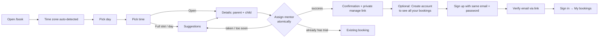

# PRD: Trial-Class Booking

| | |
|---|---|
| Status | Ready for implementation |
| Owner | Amit Pile |
| Last updated | 2026-10-08 |
| Related | [Technical Design](./TECHNICAL_DESIGN.md) |

**Contents:** 1 Problem · 2 Goals · 3 Personas & roles · 4 Research summary · 5 User journeys · 6 Functional requirements · 7 Scheduling rules · 8 Suggestions · 9 Accounts & access · 10 Time display rules · 11 Screens & copy · 12 Edge cases · 13 Non-functional · 14 Out of scope · 15 Assumptions · 16 Glossary

---

## 1. Problem

Codeyoung parents (mostly US and UK) book a free trial class before signing up. Mentors are in India. The product has to:

- show times the parent can trust **in their own time zone**, including across Daylight Saving Time (DST) changes;
- only offer times that are **sensible for the child** and **inside the mentor's working shift**;
- assign a mentor who is actually free, with **at most 2 trials per mentor per day**;
- never double-book, even when two parents click at the same moment;
- when a time is unavailable, **steer the parent to the next best time** instead of a dead end;
- let parents **see their own bookings** securely, and let Codeyoung staff **see everything** (parents, bookings, mentor schedules), without exposing children's data to anyone else.

Scale: **10 mentors**, **~20 parents/day**. Capacity is 10 × 2 = **20 trials/day**, so demand roughly equals supply and "no availability" is a *normal* state.

## 2. Goals and success metrics

| Goal | Metric |
|---|---|
| Fast, confident booking | Booking in < 60 s with **no sign-up required**; every time shows weekday, date, time and zone |
| Correctness | 0 double bookings; 0 mentors with > 2 trials on one IST date (concurrency tests on real Postgres) |
| Sensible hours | 0 slots outside 08:00–21:00 parent-local or outside the assigned mentor's shift |
| Never a dead end | Every "unavailable" outcome shows ≥ 1 suggestion, or an explicit "fully booked for 14 days" state |
| Privacy | No booking, parent or mentor-schedule data visible without the right access (secret link, verified parent account, or admin) |
| Ops visibility | Admin can answer "who is booked with whom, when, and how full is each mentor" in one screen |

## 3. Personas and roles

| Persona | Role | Time zone | Needs |
|---|---|---|---|
| **Parent (guest)** | none | US or UK/Ireland | Book a trial with just an email; manage *that* booking via its private link |
| **Parent (account holder)** | `PARENT` | US or UK/Ireland | Sign up with the same email + password, verify the email, sign in, see **all** their bookings (upcoming and past), cancel |
| **Admin (Codeyoung ops)** | `ADMIN` | India | Sign in; see all parents, all bookings, all mentors with shifts and full schedules and daily load; cancel on a parent's behalf |
| **Mentor** | — (no login in this version) | India, region-aligned shift | Receives booking info in India time (via the Outbox); their schedule is viewed through the admin console |
| **Reviewer** | uses seeded admin + parent accounts | — | Run locally in minutes; see every edge state in seed data |

## 4. Research summary

| Source | What it does | What we take |
|---|---|---|
| Codeyoung "Book a Free Trial" | Subject, grade, parent contact → slot picker in local time → confirmation with link | Same data; we ask for the **time first**, then details |
| Codeyoung / Cuemath / PlanetSpark / BrightChamps hiring | US-shift tutors in India work nights (Codeyoung 2:30–7:30 AM IST; Cuemath 12–7 AM IST) | **Region-aligned mentor shifts**, including US night shifts |
| Calendly / Cal.com | Host sets hours in their own zone; invitee sees them converted; per-day limits. **Invitees need no account**: confirmation emails carry private cancel/reschedule links | Guest booking + a **private manage link** per booking; mentor shift = availability; 2/day cap |
| Typical consumer portals | Optional account to see history; email verification before showing personal data | **Optional parent account** (email + password) with **email verification** before bookings are shown |

## 5. User journeys

### 5.1 Parent: book (guest) and optionally create an account

Signed-in parents get the booking form pre-filled with their name and email.

### 5.2 Admin

`/admin/login` → Dashboard (today, upcoming, capacity per IST date) → Bookings (filter/search/cancel) · Parents (list → detail with bookings) · Mentors (list → shift + full schedule by IST date with `n/2` load) · Outbox.

## 6. Functional requirements

| ID | Requirement | Acceptance criteria |
|---|---|---|
| **FR-1** Time zone | Detect the parent's IANA zone from the browser; change it via a searchable picker (US, UK, Ireland, India pinned); remember it in the browser. | AC1 New York browser → "Eastern Time (UTC−04:00)". AC2 Changing to London re-renders all slots. AC3 `Asia/Calcutta` accepted. AC4 Detection fails → picker opens. |
| **FR-2** Slot calendar | 14-day strip; slots for the selected day grouped Morning (8–12) / Afternoon (12–5) / Evening (5–9) by local start. Full slots shown greyed and clickable; unstaffed times hidden. | AC1 Each slot shows local time + zone. AC2 Full announced to screen readers. AC3 Day badges Open / Few left / Full / No classes. |
| **FR-3** Slot rules | 60-min class, 30-min grid, ≥ 2 h notice, ≤ 14 days ahead (configurable). | AC1 Nothing < 2 h from server "now". AC2 Nothing beyond 14 days. |
| **FR-4** Reasonable hours | Whole class inside **08:00–21:00 parent-local** *and* inside **a mentor's shift** (§7). | AC1 Holds across DST changes. AC2 A crafted 3 AM request is rejected (`OUTSIDE_HOURS`). |
| **FR-5** Availability | Open if ≥ 1 mentor is on shift, has no overlapping class, and has < 2 trials that **IST date**. | AC1 Mentor at 2/2 disappears from other slots that IST date. AC2 Cancelling restores availability. |
| **FR-6** Booking form | Parent name, email, phone (optional), child name, grade (1–12), subject (Coding/Math). **No account needed.** Pre-filled when signed in (email locked to the account email). | AC1 Inline errors per Technical Design §9.3. |
| **FR-7** Mentor assignment | Atomic assignment, least-loaded mentor first; booking reference `CY-7K3P9Q` + dummy class link. | AC1 No overlaps per mentor. AC2 ≤ 2 per mentor per IST date. AC3 Double-submit → one booking. |
| **FR-8** Confirmation | Parent-local time + zone, India time, mentor card (name, bio, shift), class link + copy, Add to Calendar (.ics + Google), reference, Cancel, and a **private manage link**. Guests see a "Create an account to see all your bookings" prompt. | AC1 If current zone ≠ booked zone, show both. AC2 The manage link works without login. |
| **FR-9** Notifications | Every booking/cancellation writes Outbox messages: one to the parent (parent zone) and one to the mentor (India time + parent's local time). Auth emails (verify, reset) also go to the Outbox. | AC1 Mentor message shows IST date/time and the parent's local time. |
| **FR-10** Manage a booking (guest) | `/booking/:ref?token=…` shows the booking and allows cancelling until class start. No lookup by email. | AC1 Wrong/missing token → "not found". AC2 Cancelling twice → same result. |
| **FR-11** Suggestions | When the chosen time can't be booked, show the §8 cascade; one click selects a suggestion, form data kept. | AC1 Each step returns documented results. AC2 Suggestions never break FR-3/4/5. |
| **FR-12** One active trial | One email may hold only **one upcoming confirmed trial**. | AC1 Second attempt shows the existing booking (with manage link if signed in, otherwise "check your confirmation"). |
| **FR-13** DST notice | Banner when a clock change in the parent's zone falls within the window. | AC1 With "now" = 20 Oct 2026, New York shows "Clocks go back on Sun 1 Nov. Times from then are in EST." AC2 With "now" = 8 Oct, no banner (window ends 22 Oct). |
| **FR-14** Parent sign-up | Sign up with name, email, password. The account is **pending** until the email is verified via a link (valid 24 h). Sign-up for an email that already has a verified account must not reveal that; the Outbox gets a "you already have an account" message instead. | AC1 Unverified accounts can't sign in to see bookings ("Please verify your email" + resend). AC2 Same response for new vs existing emails. |
| **FR-15** Parent sign-in / out | Email + password → session (7 days). Sign out ends it. Wrong credentials → one generic message. Rate-limited. | AC1 Generic "Email or password is incorrect". AC2 6th attempt within a minute → "Too many attempts". |
| **FR-16** Forgot password | Request a reset link (valid 1 h, single use) → set new password → all sessions for that parent end. Same response whether or not the email exists. | AC1 Used/expired link → "This link has expired. Request a new one." AC2 A successful reset also verifies the email (the link proves inbox access). |
| **FR-17** My bookings | Signed-in, verified parents see **every booking made with their email**, including guest bookings made before sign-up: Upcoming and Past/Cancelled tabs, each with details, link and cancel. | AC1 A guest booking made before sign-up appears after verification. AC2 Another parent's booking is never visible (404). |
| **FR-18** Admin sign-in | Email + password for admin accounts (seeded from env). Session 12 h. Rate-limited. Separate from parent sessions. | AC1 Non-admin → admin pages redirect to `/admin/login`; admin APIs return 401/403. |
| **FR-19** Admin console | **Dashboard:** upcoming trials today/next 7 days, capacity used per IST date (booked ÷ 20), fully booked days. **Bookings:** table with date range, status, mentor and parent-email filters; cancel with confirmation. **Parents:** list (name, email, account status Guest / Pending / Verified, booking count) → detail with all bookings. **Mentors:** list (shift, today's load) → detail with weekly shift and full schedule by IST date (`n/2` meter, child, subject, parent's local time, link). **Outbox:** all messages. Times shown in India time with the parent's local time alongside. | AC1 Admin cancel writes Outbox messages to parent and mentor and frees capacity. AC2 Every view is read-only except cancel. |
| **FR-20** Dev Outbox | `/dev/outbox` lists all Outbox messages (newest first) with clickable links. Enabled only in development (`DEV_OUTBOX_ENABLED=true`); in production it's off and admin-only via the console. | AC1 Verification and reset links can be completed from the Outbox. |

## 7. Scheduling rules: reasonable hours on both sides

### 7.1 The two rules

| Side | "Reasonable" means | Rule |
|---|---|---|
| **Parent / child** | Not before 8 AM or after 9 PM where the child lives | Whole class inside **08:00–21:00 parent-local**, worked out **per local date** (DST automatic) |
| **Mentor** | Only hours they agreed to work, which may be an IST night shift | Whole class inside **one of the mentor's shift rules** (in the mentor's zone). No global IST cap. Protected by opt-in shifts + 2 trials/day cap |

### 7.2 Shifts (seed data, IST)

| Shift | IST hours | Mentors | Serves |
|---|---|---|---|
| UK shift | 13:00–23:30 | 4 | UK/Ireland daytime and after-school; US mornings |
| US-East shift | 00:30–07:30 | 4 | US East/Central after-school evenings (Codeyoung's real US shift: 2:30–7:30 AM IST) |
| US-West shift | 03:30–09:30 | 2 | US Pacific/Mountain/Alaska/Hawaii afternoons and evenings |

No shift crosses IST midnight, so the 2/day cap maps onto one IST calendar date. Each mentor has one staggered day off per week (weekday in IST).

### 7.3 What each parent zone gets

Class start times, combining all shifts and the 08:00–21:00 parent window (weekday, all mentors working):

| Parent zone | 20 Oct 2026 (before clocks change) | 10 Nov 2026 (after) |
|---|---|---|
| UK / Ireland | 8:30 AM–6:00 PM, plus 8:00 PM (BST) | 8:00 AM–5:00 PM, plus 7:00–8:00 PM (GMT) |
| US Eastern | 8:00 AM–1:00 PM and **3:00–8:00 PM EDT** | 8:00 AM–12:00 PM and **2:00–8:00 PM EST** |
| US Central | 8:00 AM–12:00 PM and **2:00–8:00 PM CDT** | 8:00–11:00 AM and **1:00–8:00 PM CST** |
| US Mountain (Denver) | 8:00–11:00 AM and **1:00–8:00 PM MDT** | 8:00–10:00 AM and **12:00–8:00 PM MST** |
| Arizona (no DST) | 8:00–10:00 AM and **12:00–8:00 PM MST** | same |
| US Pacific | 8:00–10:00 AM and **12:00–8:00 PM PDT** | 8:00–9:00 AM and **11:00 AM–7:00 PM PST** |
| Alaska | 8:00–9:00 AM and 11:00 AM–7:00 PM AKDT | 8:00 AM and 10:00 AM–6:00 PM AKST |
| Hawaii | 9:00 AM–5:00 PM HST | 9:00 AM–5:00 PM HST |

Clock changes move the edges (London's last afternoon start 6:00 → 5:00 PM after 25 Oct; US Pacific's last evening start 8:00 → 7:00 PM after 1 Nov). This comes from the per-day calculation, not hard-coding. The table doubles as a test fixture.

## 8. Suggestions when the chosen time isn't available

Input: the parent wanted **date D at local time T**. Try each step in order; **stop at the first that finds something**.

| Step | Applies when | Returns | Headline |
|---|---|---|---|
| **1 · Same day** | D has ≥ 1 Open slot | Up to **4** Open slots on D, closest to T (ties: earlier first) | "No mentor is free at 9:00 AM on Sat 31 Oct. These times that day are open:" |
| **2 · Same time, other days** | D has no Open slot | Up to **3** other days (today onwards, within 14 days) where **T** is Open, nearest to D first (ties: later day) | "Sat 31 Oct is fully booked. 9:00 AM is open on these days:" |
| **3 · Closest good times** | T isn't Open on any day | Up to **4** Open slots from the earliest days with openings, **max 2 per day**, each closest to T | "We couldn't find 9:00 AM on nearby days. Here are the closest good times:" |
| **4 · Nothing open** | No Open slot in 14 days | Empty state | "We're fully booked for the next two weeks. Please check back soon or contact us at hello@codeyoung-demo.com." |

Rules: suggestions come from **the same slot list** as the calendar (so they always respect notice, horizon, hours and capacity). "Same time" = same **local clock time** for the parent, even across DST. If T is within mentor hours on one side of a clock change but not the other, step 2 adds a note ("From Mon 2 Nov, 8:00 PM PT is outside our mentors' hours."). Each suggestion shows weekday, date, time and zone and is one click.

## 9. Accounts and access

### 9.1 Principles

1. **Booking never requires an account.** A sign-up wall in front of a free trial loses parents.
2. **Personal data needs proof of ownership.** Possession of a booking's private link (sent with the confirmation) proves access to *that booking*; a **verified** email + password proves access to *all bookings for that email*. Booking alone never signs anyone in. Otherwise someone could book with another parent's email and read their history.
3. **Staff see everything; nobody else does.** The old public mentor view is replaced by the admin console.
4. **No account enumeration.** Sign-up, sign-in and forgot-password responses never reveal whether an email is registered.

### 9.2 Account states (per parent email)

| State | How you get there | Can see |
|---|---|---|
| **Guest** | Booked with an email, no sign-up | Each booking via its private link only |
| **Pending** | Signed up, email not yet verified | Same as Guest; sign-in shows "Please verify your email" + resend |
| **Verified** | Clicked the verification link | My bookings (all bookings for that email, including earlier guest bookings) |

### 9.3 Access matrix

| Resource | Anonymous | Booking link holder | Verified parent | Admin |
|---|---|---|---|---|
| Slots, suggestions | ✓ | ✓ | ✓ | ✓ |
| Create booking | ✓ | ✓ | ✓ (email = account email) | — |
| View / cancel one booking | — | ✓ that booking | ✓ own bookings | ✓ all |
| My bookings list | — | — | ✓ own | — |
| Parents, mentors, schedules, all bookings, Outbox | — | — | — | ✓ |

### 9.4 Password and session rules

- Password: 8–128 characters, not equal to the email; no composition rules (NIST guidance); stored with argon2id.
- Parent session: 7 days, extended on use. Admin session: 12 hours, not extended.
- Sign-in, sign-up, forgot-password: rate-limited (5 per minute per IP + email).
- Password reset or sign-out ends sessions (reset ends *all* of that parent's sessions).

## 10. Time display rules

1. Always show **weekday, date, time and zone**: `Sat 31 Oct · 8:30 AM EDT`.
2. Headers show full zone name + offset: `Eastern Time (UTC−04:00)`.
3. **Never a bare "IST".** India: `IST (India)` / `India Standard Time (UTC+05:30)`. Dublin: `GMT` / `GMT+1` / `Irish time (UTC+01:00)`.
4. London shows `BST` / `GMT` (US-English browsers print "GMT+1"; we use our own label map).
5. DST banner per FR-13.
6. If the booked zone ≠ current browser zone, also show the current-zone time.
7. Admin and mentor-facing times: India time first, parent's local time alongside.
8. Tabular numerals; 12-hour clock.

## 11. Screens and key copy

| Route | Access | Content | States & copy |
|---|---|---|---|
| `/book` (step 1) | public | Zone bar, DST banner, day strip, slot groups | Loading skeleton. Full day: "This day is fully booked" + suggestions. Closed day: "No classes on this day." Network: toast "Couldn't load times. Retry" |
| `/book` (step 2) | public | Pinned slot ("Change"), form (pre-filled if signed in) | "Booking…". Slot errors → suggestions panel, form kept. Active trial: "You already have a trial on Tue 3 Nov · 4:00 PM EST." |
| `/booking/:ref?token=` | link holder / owner / admin | Confirmation: big local time, India time, mentor card, link + copy, add to calendar, reference, cancel; guest prompt "Create an account to see all your bookings" | Cancelled: "This booking was cancelled" + "Book another time". Bad token: "We couldn't find this booking." |
| `/signup` | public | Name, email, password | Success (always): "Check your email to verify your account." + link to Outbox in dev |
| `/verify-email?token=` | public | Verifies, then redirects to `/login` | "Email verified. You can sign in now." / "This link has expired. Request a new one." |
| `/login` | public | Email, password; links to sign up and forgot password | "Email or password is incorrect." · "Please verify your email first. Resend link" · "Too many attempts. Try again in a minute." |
| `/forgot-password`, `/reset-password?token=` | public | Request link; set new password | Always "If an account exists, we've sent a reset link." · Expired link copy as above |
| `/my-bookings` | verified parent | Tabs Upcoming / Past & cancelled; cards with time, mentor, link, cancel | Empty: "No bookings yet." + "Book a free trial" |
| `/admin/login` | public | Email, password | Generic error; rate limit copy |
| `/admin` | admin | Dashboard tiles + capacity per IST date (next 14 days) | — |
| `/admin/bookings` | admin | Filterable table; cancel (confirm dialog) | Empty: "No bookings match these filters." |
| `/admin/parents`, `/admin/parents/:id` | admin | List with status badge + counts; detail with bookings | — |
| `/admin/mentors`, `/admin/mentors/:id` | admin | List with shift + today's load; detail with weekly shift and schedule by IST date | "No trials booked in the next 14 days." |
| `/admin/outbox`, `/dev/outbox` | admin / dev only | Messages newest first, links clickable | "No messages yet." |

## 12. Edge cases

Each row has a test (Technical Design §16).

### 12.1 Time zones and DST

| # | Scenario | Expected behaviour |
|---|---|---|
| T1 | UK leaves BST on **25 Oct 2026**, US leaves EDT on **1 Nov 2026** | 18:00 IST shows 1:30 PM BST → 12:30 PM GMT; 8:30 AM EDT (31 Oct) → 7:30 AM EST (2 Nov). Never fixed offsets. |
| T2 | 23 h / 25 h DST days | Grouped by real local day; nothing lost or duplicated. |
| T3 | Repeated hour on fall-back night | Never offered (window starts 08:00); formatter still labels `1:30 AM EDT` vs `EST` correctly. |
| T4 | Skipped hour on spring-forward night | Never offered; mentor rules in a DST zone shift forward predictably. |
| T5 | Parent's day ≠ mentor's day (Tue 7:30 PM PT = Wed 8:00 AM IST) | Each side sees its own date; cap counts on the IST date. |
| T6 | All US zones, Arizona, Hawaii, Alaska, UK, Ireland | Correct both sides of each transition. |
| T7 | "IST" ambiguity | Display rule 3. |
| T8 | Legacy zone names / no zone | Normalised / manual picker. |
| T9 | Travelling parent | Both times shown. |
| T10 | Wrong device clock | Server decides "now". |
| T11 | Clock change moves window edges | Matches §7.3. |
| T12 | "Same time, other days" across DST | Same local clock time; IST differs. |
| T13 | Absurd family hours via API | `OUTSIDE_HOURS`. |
| T14 | Outside every mentor's shift | Not offered; `OUTSIDE_HOURS`; never assigned outside a mentor's own shift. |

### 12.2 Capacity, availability, concurrency

| # | Scenario | Expected behaviour |
|---|---|---|
| C1 | Two parents grab the last free mentor | One succeeds; the other gets suggestions ("That time was just booked."). |
| C2 | Same slot, several mentors free | Both succeed, different mentors. |
| C3 | Mentor hits 2 on an IST date | Gone from other slots that IST date. |
| C4 | All staffed mentors busy | Slot Full → suggestions. |
| C5 | All mentors at 2/2 | Day Full → suggestions start at step 2. |
| C6 | Local day spans two IST dates | Availability per slot, never per assumed day. |
| C7 | Double-click / retry | One booking, same response. |
| C8 | Same parent, two tabs | Second → existing booking. |
| C9 | Slot becomes too soon mid-form | "Too soon" + suggestions. |
| C10 | Cancellation (parent, link or admin) | Capacity freed immediately; Outbox messages written. |
| C11 | Whole window full | Step 4 empty state. |
| C12 | Invalid input | Inline errors; server returns the same messages. |

### 12.3 Accounts and access

| # | Scenario | Expected behaviour |
|---|---|---|
| A1 | Guest books, later signs up with the same email | After verification, the earlier booking appears in My bookings. |
| A2 | Someone signs up with an email they don't own | Account stays Pending; no bookings shown. If the real owner signs up later, their sign-up replaces the pending password and invalidates the old verification link; only the inbox owner can verify. Forgot-password also works for Pending accounts. |
| A3 | Sign-up with an email that already has a verified account | Same "check your email" response; Outbox gets "You already have an account" with sign-in/reset links. |
| A4 | Signed-in parent books | Email locked to account email; booking appears in My bookings immediately. |
| A5 | Signed-in parent opens another parent's booking URL without token | 404 (not 403, to avoid confirming it exists). |
| A6 | Booking link leaked | Grants view/cancel of that one booking only, never the account. |
| A7 | Expired / reused verify or reset link | "This link has expired. Request a new one." |
| A8 | Brute-force sign-in | Rate-limited; generic error. |
| A9 | Password reset | All existing sessions for that parent end. |
| A10 | Parent session tries an admin API | 403. Admin and parent sessions are separate cookies. |
| A11 | Session expired mid-use | API 401 → redirect to the right login page, then back to where they were. |
| A12 | Pending account tries to sign in | "Please verify your email first." + resend (rate-limited). |

## 13. Non-functional requirements

- **Correctness enforced by the database**, not only application code.
- **Security:** argon2id passwords; random, hashed session ids and tokens; httpOnly + SameSite=Lax cookies (Secure in production); Origin check on state-changing requests; rate limits on auth and booking; validation on every input; no stack traces in responses; no PII in logs beyond ids.
- **Accessibility:** keyboard-navigable slot grid and admin tables; labelled controls; visible focus; WCAG AA contrast.
- **Responsive** down to 360 px (admin tables scroll horizontally on small screens).
- **Performance:** slot listing < 200 ms on seed data.

## 14. Out of scope (with reasons)

| Item | Why not now |
|---|---|
| Mentor login | Admin console covers viewing schedules; same auth mechanism can add a `MENTOR` role later |
| Real email / WhatsApp | Outbox stands in; a provider can be plugged in |
| Social login / 2FA / email change | Not needed for a demo; documented as future |
| Admin user management UI | One seeded admin from env |
| Admin editing of shifts / creating bookings | Shifts are seed data; admin can cancel only |
| Rescheduling | Cancel + rebook |
| Mentor time-off, subject matching, waitlist, soft holds | See Technical Design §19 |

## 15. Assumptions

- "Per day" for the cap = the mentor's **IST calendar date**; shifts don't cross IST midnight.
- Trial = 60 min, no buffer.
- Parent window 08:00–21:00 local, every day.
- A parent account is identified by email; all bookings with that email belong to it once verified.
- One seeded admin account; credentials come from env vars (documented in README).

## 16. Glossary

| Term | Meaning |
|---|---|
| Slot | 60-min class start on the 30-min UTC grid |
| Open / Full / Closed | Bookable / staffed but no free mentor / nobody on shift |
| Shift | A mentor's weekly working hours (availability rule) in their own zone |
| IST date | Calendar date in `Asia/Kolkata`; key for the 2/day cap |
| Parent window | 08:00–21:00 in the parent's zone |
| Manage link | Private per-booking URL with a secret token |
| Outbox | Stored outgoing messages (booking + auth emails) shown in dev/admin instead of sending real email |
